# Practica 3.5

## Introducción

Esta práctica consistirá en desplegar una aplicación Flask utilizando un servidor **WSGI** (Gunicorn), que actuará como intermediario entre el servidor web **Nginx** y la aplicación, que en este caso será una aplicación **Flask**.
 

## Instalar herramientas de Python:

Primero instalamos el gestor de paquetes de python

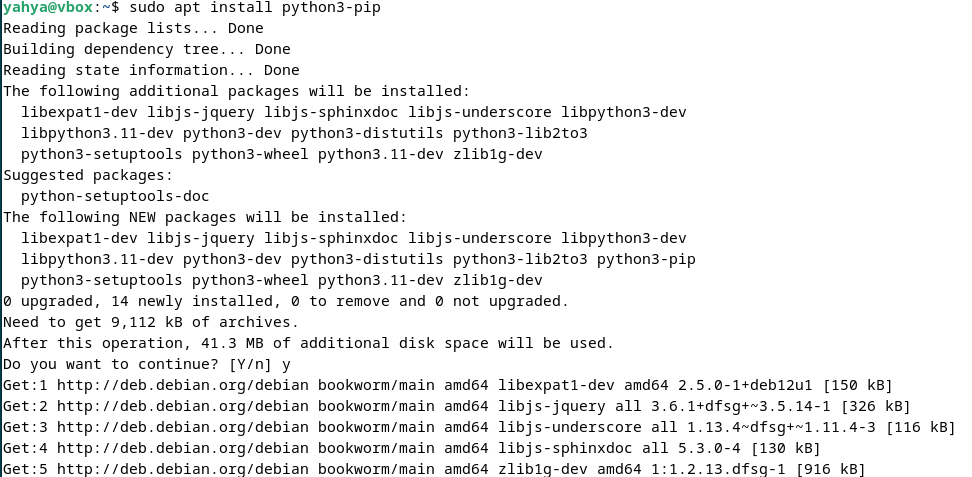

Instalamos la herramienta para gestionar los entornos virtuales 

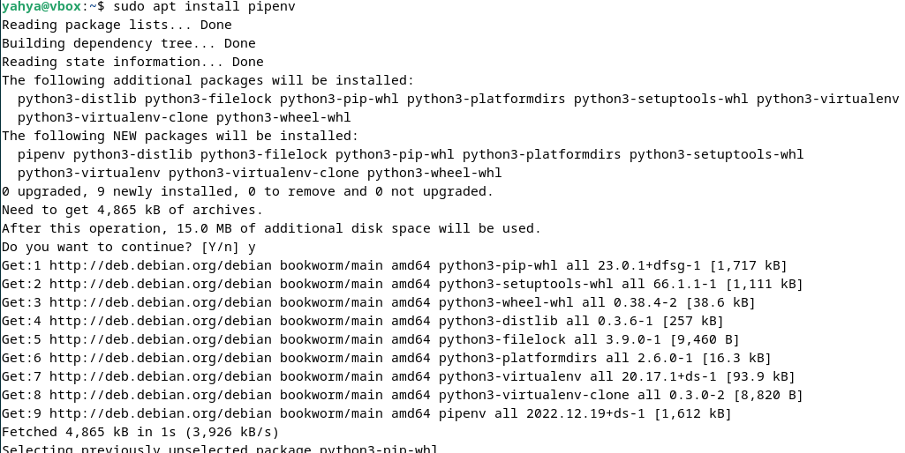

## Crear proyecto:

Creamos el directorio raiz de nuestro proyecto:


Cambiamos el propietario al usuario ```yahya``` y al grupo ```www-data```

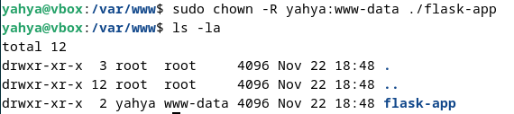

Y tambien establecimos los permisos

    sudo chmod -R 775 /var/www/flask-app


Creamos el archivo .env, que contiene las variables de entorno necesarias:

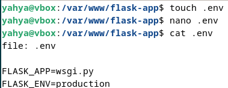

Iniciamos nuestro proyecto:

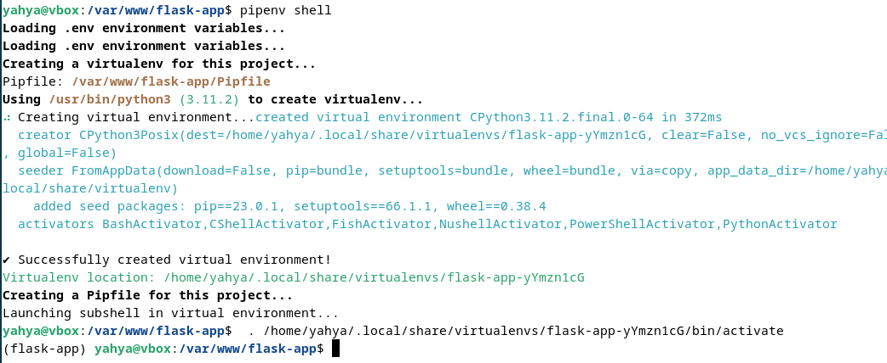

## Flask && Gunicorn

Instalamos Flask y Gunicorn

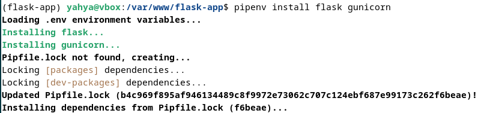

Creamos una aplicacion simple para probar gunicorn

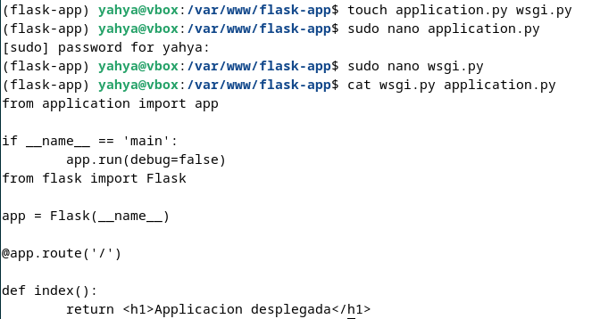

Corremos nuestro servidor flask

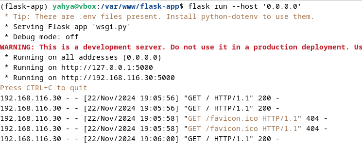

Y se aprecia que se ha desplegado correctamente:

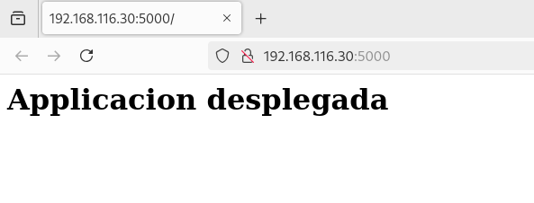

Y ahora lo desplegamos usando Gunicorn:

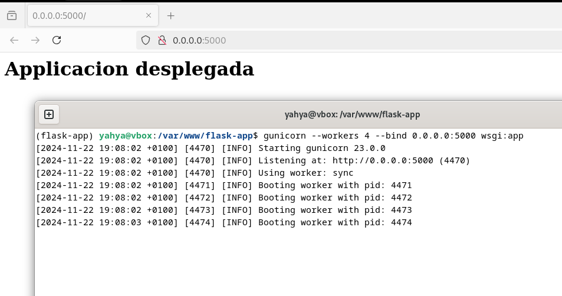

* ```--workers```: Determina cuantos procesos trabajadores van a manejar las peticiones HTTP recibidas del servidor.
* ```--bind '0.0.0.0'```: Indica a Gunicorn que escuche todas las interfaces
* ```wsgi```: es el nombre del modulo con la extencion .py que se va a ejecutar.
* ```app```: es el nombre de instancia dentro del modulo wsgi.

<br>

Determinamos la ruta donde se encuentra instalado el ejecutable de Gunicorn.

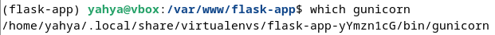

<br>

Inicializamos el servidor ```nginx```:

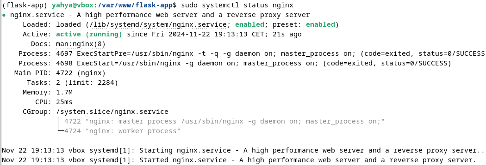

<br>

Crear un servicio externo para Gunicorn para que se ejecute automaticamente sin tener que manejarlo desde la terminal


<br>

Iniciar el servicio gunicorn de nuestra app

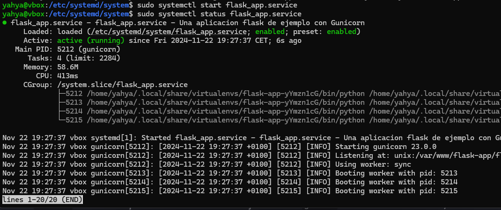

<br>

Configuramos nuestro servidor nginx estableciendo un proxy que redirigira las peticiones al servidor de Gunicorn

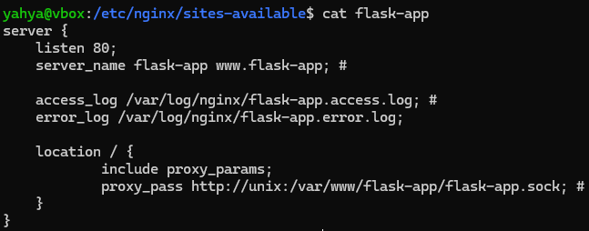

<br>

Habilitamos la configuracion:

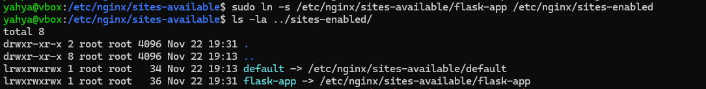

<br>

Inicializamos nginx con la configuracion establecida

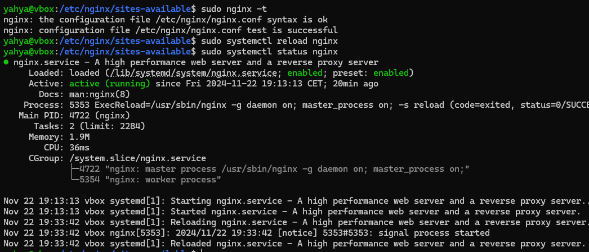

Accedemos desde nuestra maquina anfitriona a nuestra applicacion alojada en nuestro servidor web despues haber puesto el nombre de nuestro nombre de dominio con la ip de la maquina virtual

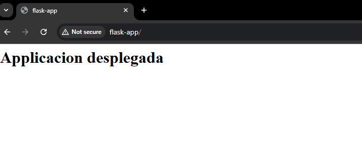

## Ejercicio:

Se han aplicado todos los pasos anteriores al proyecto del repositorio:

    https://github.com/raul-profesor/Practica-3.5

<br>

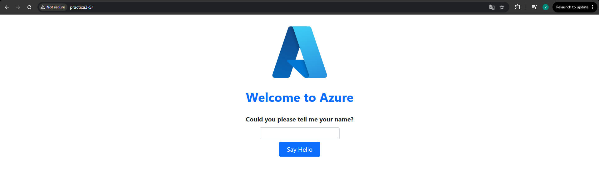

Se aprecia que se ha desplegado correctamente, y se ha podido acceder a el desde la maquina anfitriona.

## WSGI:

### Definicion

**WSGI** (Web Server Gateway Interface) es un estándar que define cómo los servidores web deben interactuar con las aplicaciones web escritas en Python. Este estándar permite el despliegue de aplicaciones como Django y Flask, asegurando que sean portables y puedan ser ejecutadas en cualquier servidor compatible. Un ejemplo de servidor compatible con WSGI es Gunicorn, que actúa como intermediario entre el servidor web (como Nginx) y la aplicación Python, gestionando las solicitudes HTTP y pasándolas a la aplicación para su procesamiento.

### Flujo

1. Cliente realiza una solicitud HTTP (por ejemplo, para una página web).
2. Nginx recibe la solicitud, gestiona conexiones y archivos estáticos, y la pasa a Gunicorn.
3. Gunicorn recibe la solicitud, la envía a la aplicación Python (como Flask o Django) a través de WSGI.
4. La aplicación Python procesa la solicitud, genera una respuesta y la devuelve a Gunicorn.
5. Gunicorn pasa la respuesta de vuelta a Nginx.
6. Nginx devuelve la respuesta final al cliente (por ejemplo, renderiza la página web en el navegador).
